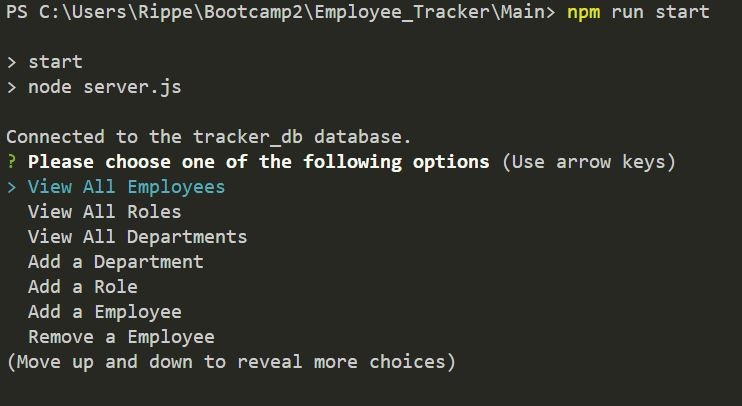

# Employee Tracker
This is a employee tracker where you can view what employee has what job and the money they make

## General Information
- The Employee tracker can show you employees roles, saleryes and names
- You can also add and remove employees and add new departments to expand your terminal based empire.

## Features
- You can add and remove employee's
- You can create more departments
- You can create new roles to assign to future employees
- Clicking on one option will open its results and then send you back to the main menu so you can view other functions

## Screenshots / Links

Link to a walkthrough video!

[Untitled_ Jun 27, 2023 11_36 PM.webm](https://github.com/TristanM225/Employee_Tracker/assets/126945628/ddf8cc2a-ad9f-4882-b94c-92e681b719f5)

 

## Setup
- Set up requires you to npm i
- then open sql and SOURCE schema and seeds
- then npm run start
- thats it!

## Usage
- to flexibly track employees of different departments!

## Project Status
Project is: _in progress_ 
This will be a on going project because learning will never stop!

## Room for Improvement
Include areas you believe need improvement / could be improved. Also add TODOs for future development.

Room for improvement:
- Cleaning up code
- Making the transitions smoother

To do:
- add a update roles option that works
- Add a proper quit function

## Credit / Acknowledgements 
- Huge Credit to Vincient, Micheal and Mallorie. 
- If not for Vincient and Mallorie asking questions in the last zooms office hours I would be completley lost! 
- Biggest thanks to Micheal for encouriging me to not give up!

## Contact
Created by TristanM225 Reach out to me by email! TristanM225@gmail.com
